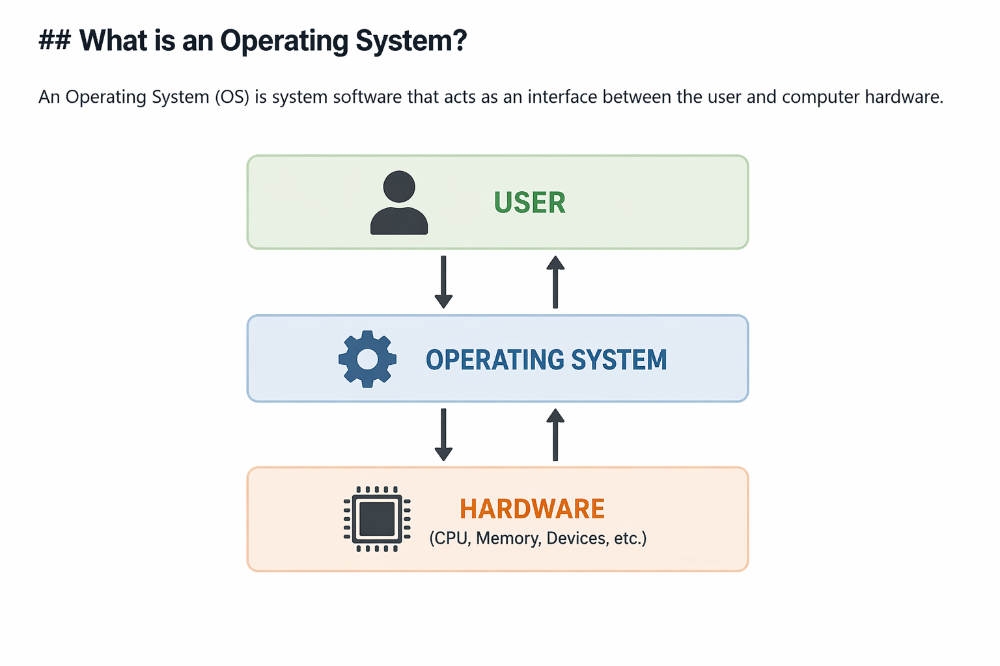

# Operating System (OS)

## What is an Operating System?
An Operating System (OS) is system software that acts as an interface between the user and computer hardware.

## Why Do We Need an OS?
- Manages hardware resources (CPU, memory, I/O)
- Provides abstraction (easy to use system)
- Handles multitasking
- Ensures security and isolation

## Key Responsibilities
- Process management
- Memory management
- File system management
- Device management

## Examples
- Linux
- Windows
- Android
- macOS

## Simple Analogy
OS is like a manager:
- You (user) give task
- OS assigns work to hardware